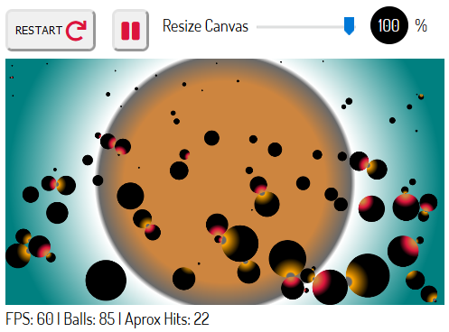

___

# Canvas Animation: Collisions
Ball interactions solved with displacement & velocity vectors. 
Impacts between different masses resolved using physics: 
conservation of momentum & kinetic energy. Energy losses allowed on 'impact' mode.

## Description
Small web app with canvas animations and some physics, maths.

___
